# Networking Tracker

A private contact tracker for the people you want to stay connected with at
Berkeley. You sign in, add the people you meet — name, company, role, where you
met, notes and a priority — and sort, filter, edit and delete them. Every
contact belongs to exactly one account, and that ownership is enforced by
Postgres Row Level Security rather than by application code, so it holds even
if someone bypasses the app and calls the public data endpoint directly.

**Live app:** <https://networking-tracker-carlos-mena.vercel.app>

---

## Contents

- [Screenshots](#screenshots)
- [Features](#features)
- [Tech stack and why](#tech-stack-and-why)
- [Architecture](#architecture)
- [Database schema](#database-schema)
- [Authentication and RLS ownership](#authentication-and-rls-ownership)
- [Local setup](#local-setup)
- [Environment variables](#environment-variables)
- [Tests](#tests)
- [Grading evidence](#grading-evidence)
- [Deployment](#deployment)
- [Known limitations](#known-limitations)

---

## Screenshots

Every image below is produced by `npm run screenshots`, which drives a real
Chrome through the running app (`scripts/capture-screenshots.mts`). They are
regenerated rather than hand-taken, so they cannot drift from the code. **These
were captured against the live Vercel deployment**, not localhost.

| Sign in | Contact list |
|---|---|
| 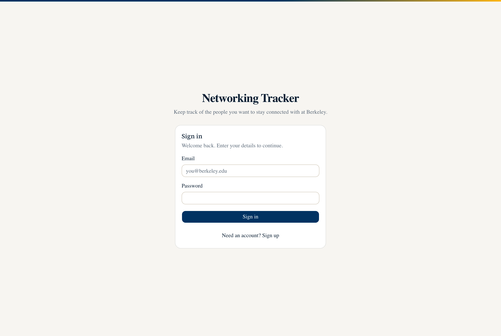 | 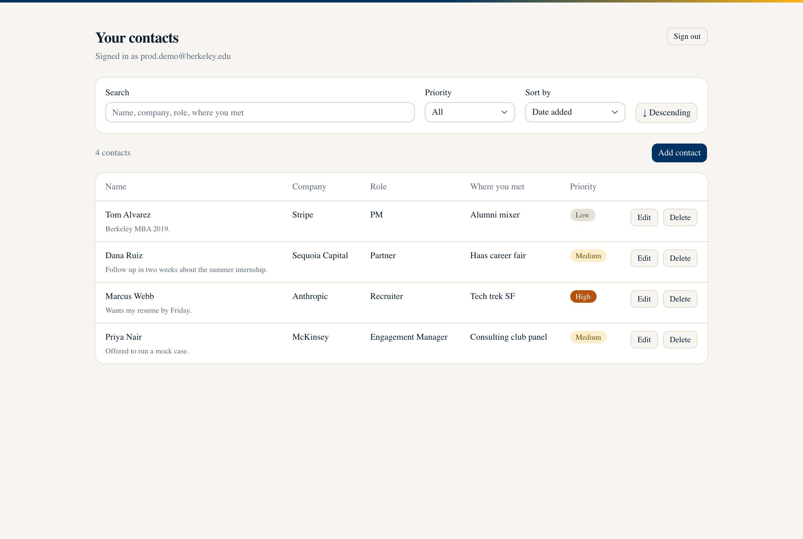 |

| Add contact | Empty state |
|---|---|
| 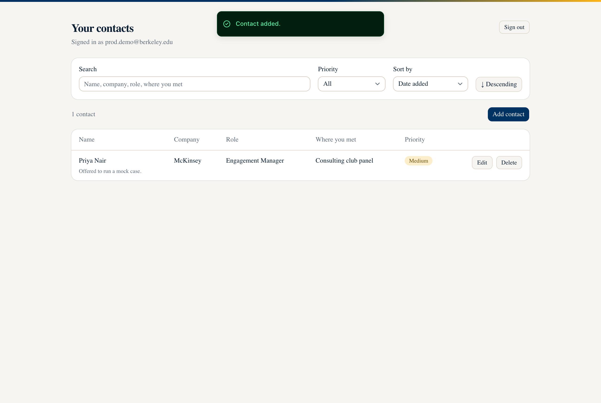 | 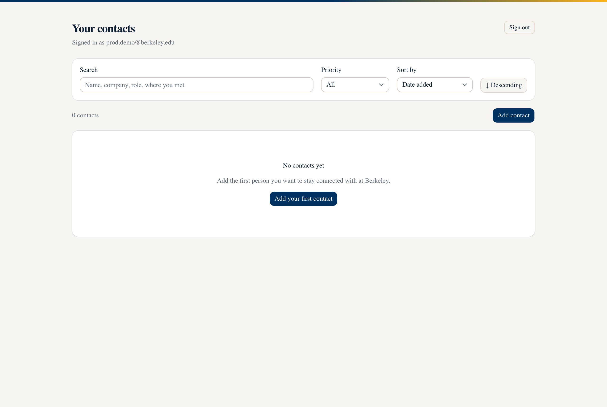 |

| Edit | Delete confirmation |
|---|---|
| 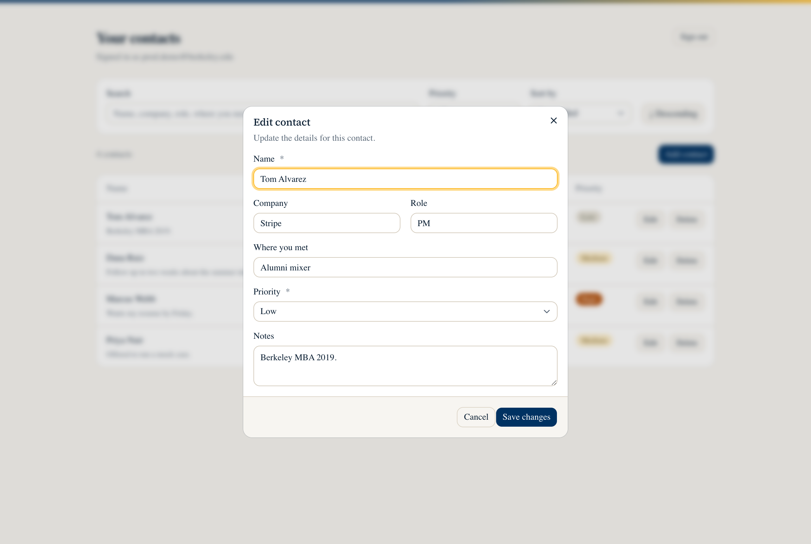 | 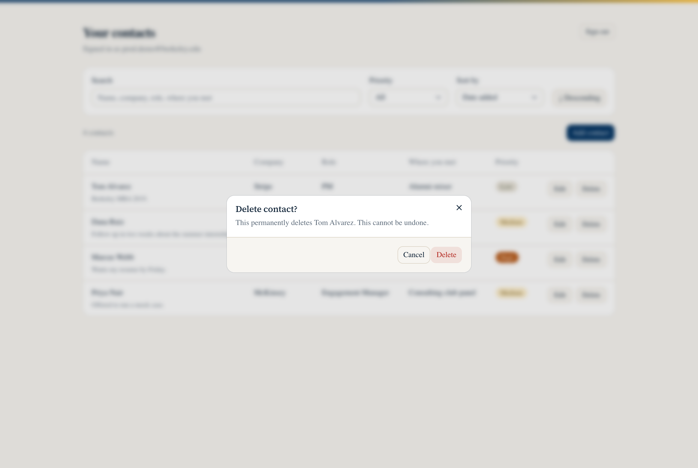 |

| Search and filter | Mobile |
|---|---|
| 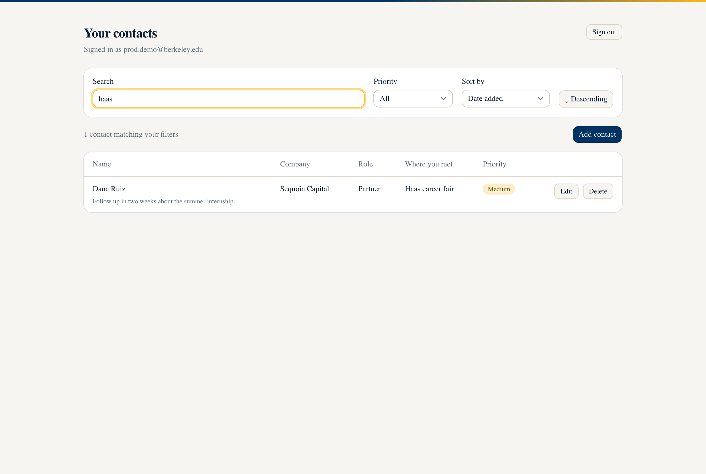 | 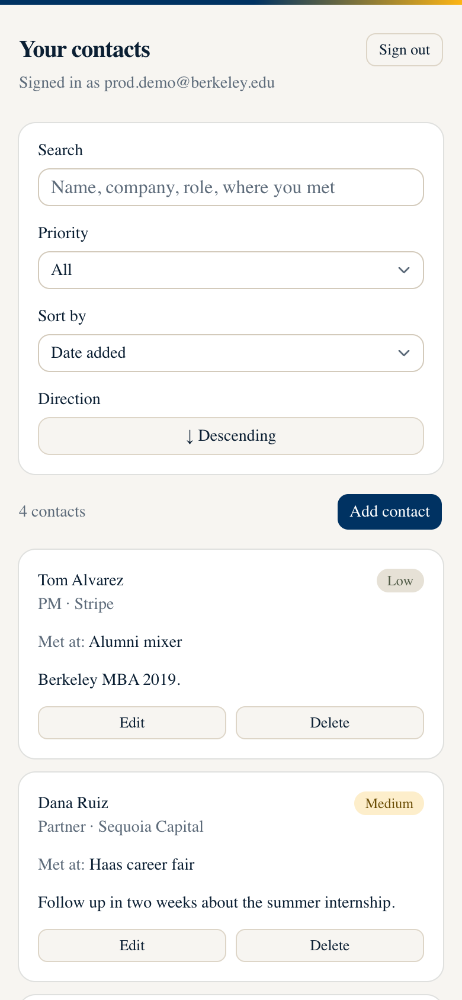 |

## Features

- Email and password sign up, sign in and sign out
- Add a contact with name, company, role, where you met, notes and priority
- Priority is restricted to `high`, `medium` or `low`
- View contacts as a table on desktop and as cards on mobile
- Sort by name, company, priority or date added, ascending or descending
- Filter by priority and search across name, company, role and where you met
- Edit and delete, with a confirmation step before deleting
- Contacts persist in Neon Postgres and survive a refresh
- Distinct loading, empty, error and success states
- Validation failures show a message on the specific field that caused them

## Tech stack and why

| Layer | Choice | Why |
|---|---|---|
| Framework | Next.js 16 (App Router, TypeScript) | One project holds the React UI and the HTTP API, while still keeping them in separate layers. Deploys to Vercel with no configuration. |
| Styling | Tailwind CSS 4 + shadcn/ui, themed to UC Berkeley | shadcn/ui gives accessible, unstyled-by-default components (dialog, select, toast) that I own in-repo, so the design system is visible in the code rather than hidden in a dependency. The palette and type are Berkeley's - see [Design](#design). |
| Auth | Neon Managed Better Auth | Users and sessions live in the same Postgres database as the data, so `auth.user_id()` is available inside RLS policies. No second system to keep in sync. |
| Data | Neon Data API (PostgREST) via `@neondatabase/neon-js` | Requests carry the user's own JWT, so Postgres evaluates RLS per request. The server never holds a privileged database credential. |
| Validation | Zod + Postgres `CHECK` constraints | Zod produces friendly per-field errors; the `CHECK` constraints are the rule that cannot be bypassed. |
| Tests | Vitest | Fast, TypeScript-native, no extra config for path aliases. |
| Hosting | Vercel | First-class Next.js support and per-environment variables. |

## Design

The component system is shadcn/ui on Tailwind 4, re-themed to the
[UC Berkeley palette](https://brand.berkeley.edu). Every colour is defined once
as a named token in `app/globals.css`, so the theme reads as colours a person
can recognise rather than raw hex scattered through components:

| Token | Berkeley colour | Used for |
|---|---|---|
| `--primary` | Berkeley Blue `#003262` | Buttons, headings, links |
| `--ring` | California Gold `#FDB515` | Focus rings |
| `--border` | Bay Fog `#DDD5C7` | Card and input borders |
| `--background` | Bay Fog tint `#F7F5F1` | Page, so white cards lift off it |
| `--accent` | California Gold | Highlights |

Type is Adobe's Source superfamily — **Source Serif 4** for headings, **Source
Sans 3** for body. Berkeley's own Freight Sans and Freight Display are
licensed and cannot be redistributed; Source is the closest open pairing in
feel, and the two faces are designed to work together.

Two decisions worth calling out:

- **Priority badges are a heat ramp, not decoration.** High is solid Wellman
  Tile, Medium is a California Gold tint, Low is Bay Fog. A tinted High badge
  read as *less* urgent than the gold Medium one, which inverted the meaning,
  so High was given solid weight. Every badge also carries the word, so the
  ranking never depends on seeing colour.
- **Contrast was measured, not eyeballed.** All three badges and the primary
  button clear WCAG AA: 5.02, 6.72, 5.59 and 12.86 to 1.

In dark mode the roles swap — gold leads and Berkeley Blue becomes the ground,
because Berkeley Blue has too little contrast against a dark navy page.

## Architecture

```
Browser (React client components)
  │
  │  fetch('/api/contacts')          same-origin, session cookie attached
  ▼
Next.js route handlers               ← the backend
  │  1. auth.getSession()  → 401 if signed out
  │  2. Zod validation     → 400 + field errors if invalid
  │  3. auth.token()       → the signed-in user's JWT
  ▼
Neon Data API (PostgREST)            Authorization: Bearer <user's JWT>
  ▼
Postgres
     RLS policies  → which rows        (auth.user_id() = user_id)
     GRANTs        → which columns     (no user_id on INSERT/UPDATE)
     CHECK         → which values      (priority, non-empty name)
```

**Frontend.** Client components in `components/` own all interaction: the
sign-in form, the contact table/cards, the create-edit dialog, sort and filter
controls. They never talk to Neon directly — only to `/api/*` on the same
origin.

**Backend.** Route handlers in `app/api/` are the only place that reads a
session or writes data. Each one authenticates, validates, then delegates to
`lib/contacts-repo.ts`.

**Auth.** `app/api/auth/[...path]/route.ts` proxies Better Auth through our own
domain. That is deliberate: it makes the session cookie first-party, so the
server can read it. The browser client (`lib/auth/client.ts`) therefore points
at `/api/auth`, not at the Neon auth host.

**Data.** `lib/contacts-repo.ts` builds a Data API client whose `getToken`
returns the caller's JWT. Notice there is no `.eq('user_id', …)` filter
anywhere in that file — RLS already restricts the rows, and adding a redundant
filter would imply security depends on remembering to write it.

### Where the two public URLs are used

`NEXT_PUBLIC_NEON_AUTH_URL` and `NEXT_PUBLIC_NEON_DATA_API_URL` are the two
URLs the assignment's "two-URL object form" refers to. They are HTTPS endpoints,
not credentials — publishing them is safe precisely because RLS protects every
row behind them. `scripts/rls-check.mts` proves that by attacking those URLs
directly.

## Database schema

Full DDL: [`db/schema.sql`](db/schema.sql).

| Column | Type | Notes |
|---|---|---|
| `id` | `uuid` | Primary key, `default gen_random_uuid()` |
| `user_id` | `text` | **`not null default auth.user_id()`** — the owner |
| `name` | `text` | `not null`, must be non-blank after trimming, ≤ 200 chars |
| `company` | `text` | Nullable, ≤ 200 chars |
| `role` | `text` | Nullable, ≤ 200 chars |
| `met_at` | `text` | Nullable, ≤ 200 chars — where you met |
| `notes` | `text` | Nullable, ≤ 2000 chars |
| `priority` | `text` | `not null`, `check (priority in ('high','medium','low'))` |
| `created_at` | `timestamptz` | `not null default now()` |
| `updated_at` | `timestamptz` | `not null default now()`, maintained by a trigger |

Index on `(user_id, created_at desc)`, matching the only query the app makes.

## Authentication and RLS ownership

When someone signs in, Neon Managed Better Auth issues a JWT whose `sub` claim
is that user's id. Every Data API request carries that JWT, and inside Postgres
`auth.user_id()` returns the `sub` claim as text. **The ownership rule is one
line, applied four times:**

```sql
auth.user_id() = user_id
```

Three independent mechanisms enforce it:

**1. RLS decides which rows.** Four separate policies, one per verb, all scoped
to the `authenticated` role:

| Policy | Clause | What it stops |
|---|---|---|
| `contacts_select_own` | `USING` | Reading someone else's contact |
| `contacts_insert_own` | `WITH CHECK` | Creating a row owned by someone else |
| `contacts_update_own` | `USING` + `WITH CHECK` | Editing someone else's row, **and** editing your row so it becomes theirs |
| `contacts_delete_own` | `USING` | Deleting someone else's contact |

The `UPDATE` policy needs both clauses. `USING` chooses which existing rows you
may target; `WITH CHECK` re-tests the row *after* your change. Without
`WITH CHECK`, you could take your own row and rewrite `user_id` to hand it to
another user — which is exactly what check 3 in the RLS script tries.

**2. Column grants decide which columns.** `authenticated` is granted
`INSERT`/`UPDATE` only on the six editable columns. `user_id` is not among
them, so a caller cannot supply or change an owner even before RLS is
consulted. On insert, the column default fills it in.

**3. `force row level security`** means the policies apply even to the table
owner, so a privileged connection cannot quietly bypass them.

Ownership is never read from the request body. `lib/validation.ts` strips
unknown keys, so a `user_id` sent by a client is discarded before it reaches the
database — and two tests assert exactly that.

## Local setup

```bash
git clone https://github.com/carlosmena1995/networking-tracker.git
cd networking-tracker
npm install
```

Then create the Neon project and apply the schema — the full walkthrough is in
[`docs/neon-setup.md`](docs/neon-setup.md). Afterwards:

```bash
cp .env.example .env.local   # fill in the values from the Neon Console
npm run dev                  # http://localhost:3000
```

## Environment variables

Names only — real values live in `.env.local` (git-ignored) and in Vercel.

| Variable | Scope | Purpose |
|---|---|---|
| `NEXT_PUBLIC_NEON_AUTH_URL` | Public | Neon Managed Better Auth endpoint |
| `NEXT_PUBLIC_NEON_DATA_API_URL` | Public | Neon Data API (PostgREST) endpoint |
| `NEON_AUTH_BASE_URL` | **Server only** | Auth base URL used by the server SDK |
| `NEON_AUTH_COOKIE_SECRET` | **Server only** | Signs the session cookie (32+ chars) |
| `DATABASE_URL` | **Server only** | Applying `db/schema.sql`; the app never reads it |

The two `NEXT_PUBLIC_` values are inlined into the browser bundle by design.
They are addresses, not secrets: RLS is what protects the data behind them. The
three server-only values are never referenced from a client component, and
`lib/auth/server.ts` is marked `import 'server-only'` so a mistaken import
fails the build rather than leaking at runtime.

## Tests

```bash
npm test          # validation + route handler tests (no database needed)
npm run test:rls  # two-account privacy proof against the real database
npm run test:privacy # two-account check through the app's own API
npm run screenshots  # regenerate the README screenshots from the running app
```

`test:rls` and `test:privacy` are deliberately different. `test:rls` bypasses
the application to prove the database is the real boundary; `test:privacy` goes
through the deployed route handlers to prove the app returns 404 rather than
somebody else's data. Both accept `BASE_URL` / `RLS_TEST_ORIGIN` so they can be
pointed at production.

`npm test` covers two things:

- **`tests/validation.test.ts`** — the shared rules: empty and whitespace-only
  names rejected, `priority: "urgent"` rejected, all three valid priorities
  accepted, length limits, trimming, and that `user_id`/`id` are stripped from
  input.
- **`tests/api-contacts.test.ts`** — the route handlers with auth and the
  database mocked: every verb returns 401 when signed out *and never calls the
  database*, invalid bodies return 400 with a per-field message and no write is
  attempted, malformed JSON does not 500, and a caller-supplied `user_id` is
  never forwarded.

`npm run test:rls` is the security proof and is described under
[Grading evidence](#grading-evidence).

## Grading evidence

Everything here is reproducible from a clone of this repository.

### 1. Automated tests pass

```
$ npm test

 ✓ tests/sort.test.ts (5 tests)
 ✓ tests/validation.test.ts (20 tests)
 ✓ tests/api-contacts.test.ts (16 tests)

 Test Files  3 passed (3)
      Tests  41 passed (41)
```

The validation tests that matter most for this rubric:

```
✓ rejects an empty name with a clear message
✓ rejects a whitespace-only name
✓ rejects a priority outside high/medium/low
✓ strips user_id so a caller cannot choose a row owner
✓ strips id so a caller cannot choose a primary key
✓ POST returns 401 when signed out and never touches the database
✓ rejects an empty name with 400 and a field error
✓ never forwards a caller-supplied user_id to the database
✓ surfaces the repository's 404 when RLS hides another user's row
✓ puts the most important first when descending
```

### 2. Sign in and sign out


Creating an account, then signing out and landing back on the sign-in screen:

| Sign up | After signing out |
|---|---|
| 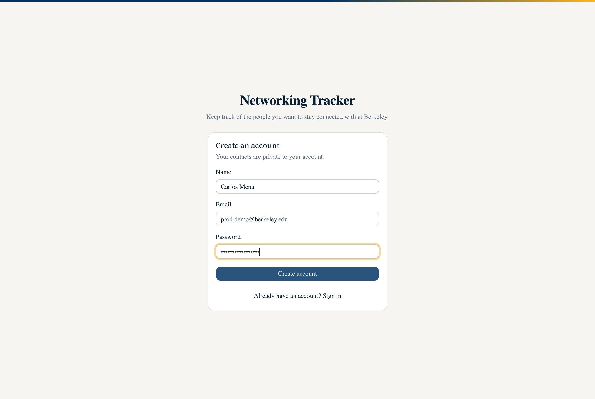 | 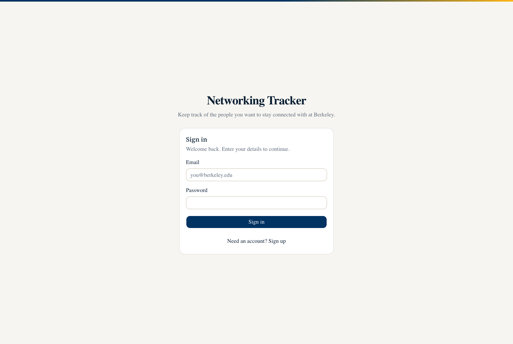 |

Signing out is enforced on the server, not just in the UI:

```
GET /api/contacts   → 401 {"error":"You must be signed in to do that."}
GET /contacts       → redirects to /sign-in
```

### 3. Create, edit, delete, and survive a refresh

| Created | Edit | Delete |
|---|---|---|
|  |  |  |

This screenshot is taken **after a full page reload**, so the rows are coming
back from Neon Postgres rather than from client state:


Sorting and filtering, verified against the live API:

```
sort=priority&direction=desc  → Priya [high], Marcus [high], Dana [medium], Tom [low]
sort=priority&direction=asc   → Tom [low], Dana [medium], Priya [high], Marcus [high]
sort=name&direction=asc       → Dana, Marcus, Priya, Tom
sort=company&direction=asc    → Anthropic, McKinsey, Sequoia Capital, Stripe
priority=high                 → Priya, Marcus
search=haas                   → Dana Ruiz
search=zzz                    → (empty)
```

### 4. User A cannot access User B's contacts

`npm run test:rls` signs in as two separate accounts and attacks the **public
Data API directly**, bypassing the Next.js app completely. This is the point:
if the route handlers were deleted, these checks would still pass, because the
protection lives in the database.

```
$ npm run test:rls

Two-account RLS check
Talking straight to the public Data API, bypassing the app entirely.
  Data API: https://ep-calm-tooth-aeraztk0.apirest.c-2.us-east-2.aws.neon.tech/neondb/rest/v1

Setup
  PASS  The two accounts resolve to different user_id values
  PASS  user_id was populated automatically by default auth.user_id()

1. Reading another user's data
  PASS  User B's full contact list does not include User A's contact
  PASS  Every row User B can read belongs to User B
  PASS  Asking for User A's contact by its exact id returns nothing

2. Modifying another user's data
  PASS  User B cannot edit User A's contact
  PASS  User B cannot delete User A's contact

3. Giving a row away (the UPDATE ... WITH CHECK rule)
  PASS  User B cannot reassign their own row to User A
  PASS  User B's row still belongs to User B afterwards

4. Planting a row on another user
  PASS  User B cannot create a contact owned by User A

5. User A is untouched
  PASS  User A's contact survived every attempt with its name intact

6. Anonymous access
  PASS  A request with no JWT returns no rows

7. Field validation is enforced by the database, not just the app
  PASS  The database rejects priority="urgent" even when the app is bypassed
  PASS  The database rejects a blank name even when the app is bypassed

14/14 checks passed.
RLS CHECK PASSED - User A and User B cannot reach each other's contacts.
```

The same two-account test, this time **through the deployed application's own
API** rather than around it:

```
$ BASE_URL=https://networking-tracker-carlos-mena.vercel.app npm run test:privacy

Two-account privacy check, through the deployed app API
  https://networking-tracker-carlos-mena.vercel.app

User A created contact a57d02e1-8ef1-4b10-b5b0-9ef8413cde96

  PASS  User B's list does not contain User A's contact
  PASS  User B editing User A's contact returns 404
  PASS  A user_id in the body does not help User B either
  PASS  User B deleting User A's contact returns 404
  PASS  A signed-out request returns 401
  PASS  User A's contact still exists
  PASS  User A's contact is unchanged

7/7 checks passed.
APP PRIVACY CHECK PASSED
```

Note the 404s. User B is never told that the contact exists - "you may not
touch this" and "this is not here" look identical from the outside, because RLS
matches no rows and the handler cannot distinguish the two cases either.

### 5. Invalid input fails safely

Submitting an empty name. The field is marked, the message names the problem,
and no row is written:

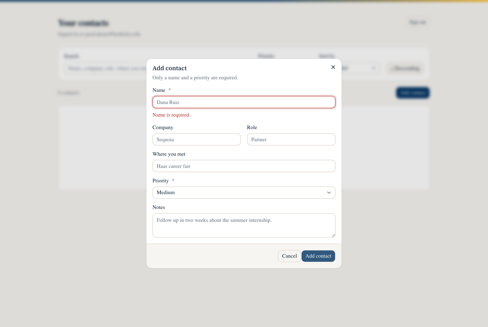

The same rule holds one layer down. Bypassing the UI and posting straight to
the API:

```
POST /api/contacts  {"name":"","priority":"high"}
→ 400 {"error":"Name is required.","fieldErrors":{"name":"Name is required."}}

POST /api/contacts  {"name":"Dana","priority":"urgent"}
→ 400 {"fieldErrors":{"priority":"Priority must be one of: high, medium, low."}}
```

And one layer below that, bypassing the app entirely (checks 7 above): the
Postgres `CHECK` constraints reject both writes even when the request goes
straight to the Data API.

### 6. Schema and RLS ownership rule

See [Database schema](#database-schema) and
[Authentication and RLS ownership](#authentication-and-rls-ownership). In one
sentence: every contact carries a `user_id` that defaults to `auth.user_id()`,
and four RLS policies restrict select, insert, update and delete to rows where
`auth.user_id() = user_id`, with the update policy's `WITH CHECK` preventing a
row from being handed to another user.

Verified in the database itself:

```sql
select
  (select count(*) from pg_policies where tablename = 'contacts')          as policies,
  (select relrowsecurity from pg_class where relname = 'contacts')         as rls_on,
  (select relforcerowsecurity from pg_class where relname = 'contacts')    as rls_forced,
  (select count(*) from information_schema.column_privileges
     where table_name = 'contacts' and grantee = 'authenticated'
       and privilege_type in ('INSERT','UPDATE')
       and column_name = 'user_id')                                        as user_id_writable;

 policies | rls_on | rls_forced | user_id_writable
----------+--------+------------+------------------
        4 | t      | t          |                0
```

`user_id_writable = 0` is the one worth pausing on: the `authenticated` role
has no INSERT or UPDATE privilege on the ownership column at all, so a caller
cannot set it even before RLS is consulted.

### 7. No secrets in the repository

```
$ git log -p --all | grep -iE "postgresql://[^ ]*:[^ ]*@|NEON_AUTH_COOKIE_SECRET=..."
(no matches)
```

`.env.local` is git-ignored; only `.env.example`, which contains placeholders,
is committed. The split is also visible in Vercel, where the public URLs are
readable and the secrets are not:

```
name                            value                 type
NEXT_PUBLIC_NEON_DATA_API_URL   eyJ2IjoidjIi…         Non-sensitive
NEXT_PUBLIC_NEON_AUTH_URL       eyJ2IjoidjIi…         Non-sensitive
NEON_AUTH_COOKIE_SECRET         Hidden                Sensitive
NEON_AUTH_BASE_URL              Hidden                Sensitive
```

Vercel actively refuses to store a `NEXT_PUBLIC_`-prefixed variable as a
secret, which is the same distinction this project relies on: those two URLs
are addresses, and RLS is what protects the data behind them.

## Deployment

```bash
npm install -g vercel
vercel            # preview
vercel --prod     # production
```

Then:

1. Vercel → Settings → Environment Variables: add all five variables. Only the
   two `NEXT_PUBLIC_` ones are public.
2. Neon Console → Auth → Configuration → Domains: add
   `https://<your-app>.vercel.app`. Localhost is allowed automatically, so this
   step only matters in production - and skipping it breaks verification and
   OAuth redirects there.
3. Vercel → Settings → Deployment Protection: turn **Vercel Authentication**
   off. New projects enable it by default, which puts a Vercel login in front
   of the deployment - the URL returns HTTP 200, but serves Vercel's login page
   instead of the app, so a grader cannot open it. From the CLI:
   `vercel project protection disable --sso`
4. Open the production URL in a private window and re-run the checks:
   ```bash
   BASE_URL=https://networking-tracker-carlos-mena.vercel.app npm run test:privacy
   RLS_TEST_ORIGIN=https://networking-tracker-carlos-mena.vercel.app npm run test:rls
   ```

Both of the production-only failures worth knowing about are authentication
allowlists rather than code problems: a missing trusted domain gives
`INVALID_ORIGIN` from Neon, and Vercel Authentication gives a Vercel login page
where the app should be. Neither reproduces locally, because Neon allows any
localhost origin automatically and protection does not apply to `vercel dev`.

## Known limitations

- **Email verification is off.** Any address can register. Fine for a graded
  demo; a real deployment should require verification before first sign-in.
- **Sorting by priority is finished in the API process.** Postgres would sort
  `high, low, medium` alphabetically, so the rank order is applied in
  `lib/contacts-repo.ts` after fetching. That is correct but would not scale to
  thousands of rows — the fix is a Postgres `enum` or a sort-order column.
- **No pagination.** Every contact is fetched at once, which is fine at personal
  scale and wrong at a few thousand rows.
- **Search runs as `ILIKE`** across four columns. It has no index behind it and
  no ranking; `pg_trgm` or a `tsvector` column would fix both.
- **No optimistic UI.** Every mutation waits for the server round trip, so the
  UI is honest but feels slower than it could.

### What I would do next

1. Pagination plus a `tsvector` search column and a GIN index.
2. Email verification and a password reset flow.
3. Tags and a "last contacted" date with a nudge for people going stale.
4. An RLS regression test in CI against a Neon preview branch, so a policy can
   never silently regress.
